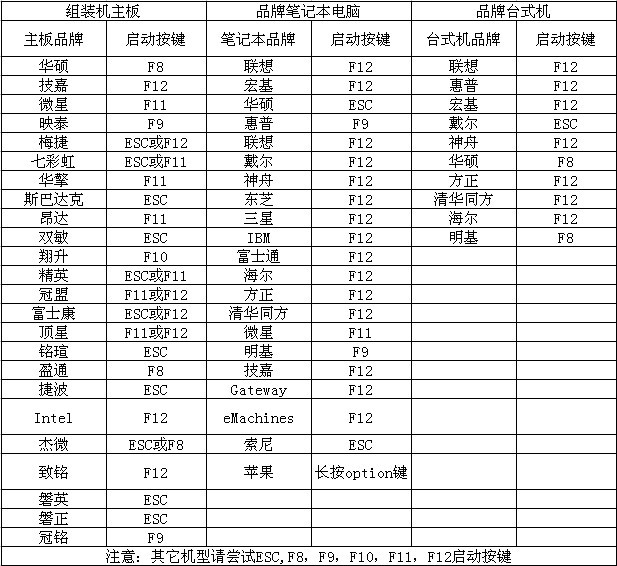

Windows使用技巧
==============

### windows命令

* `netstat -ano` 查看windows系统端口占用情况
* `nslookup -q xcx1.com` 查看域名解析情况
* `start "" "xxx.exe"` 执行文件
* `telnet 127.0.0.1 3306"` 测试服务器端口是否畅通

### 开机自启动项注册表位置:(用户)

`[HKEY_CURRENT_USER\Software\Microsoft\Windows\CurrentVersion\Run]`

### windown7系统性能优化

* 计算机=>属性=>高级系统设置=>高级=>性能设置=>视觉效果  
* 最后一栏 在最大化和最小话时动态显示窗口 前的勾去掉即可。

### 关于BOM

如果网站中出现空白行,可能是utf8+bom所导致的
如果在网页中能看见这个字符&#65279;就是utf8+bom
用window(xp 7 测试)自带的编辑器(notepad)修改后会自动保存为+bom的格式

### 添加右键菜单,带图标

````
Windows Registry Editor Version 5.00  
[HKEY_CLASSES_ROOT\*\shell\z_sublime3]  
"Icon"="C:\\Program Files\\Sublime Text 3\\sublime_text.exe,0"  
  
[HKEY_CLASSES_ROOT\*\shell\z_sublime3\Command]

@="\"C:\\Program Files\\Sublime Text 3\\sublime_text.exe\" \"%1\""
````

### 解决svchost占用内存过高问题

> (TIPS:一般是window update)

* 找到 进程 `svchost`点击<右键>转到服务
* 根据选中的`服务描述`找到对应的**服务**
* 将内存占用过高的服务停止, 并设置为`手动`启动即可


### 关机任务管理shutdown

* 一个小时后自动关机`shutdown -s -t 3600`
* s:关机，r:重启，t:时间(秒)


### 服务管理

* 创建服务
`sc create 服务名称 binPath= "路径 -参数1 -参数2" start= auto`

> 例如:`sc create FlashFXP binPath= "D:\FlashFXP\FlashFXP.exe -a" start= auto`
> TIPS: 注意: 等号的右边必须有一个空格

* 删除服务
`sc delete 服务名称`

* 启动服务
`net start 服务名`

* 停止服务
`net stop 服务名`

### 取消ctrl+alt+方向键，屏幕方向改变

桌面空白处右键->图形选项->快捷键->禁用


### 各种品牌的电脑进入U盘的快捷键


