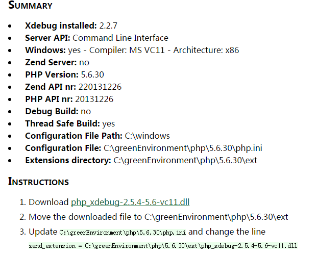
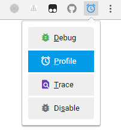

Xdebug的基本使用
===============

> 其中用到的PHP路径请替换成您自己的对应的PHP路径。


## 安装

1.打开cmd执行命令

```bash
# 修改成为你自己的php路径
C:\greenEnvironment\php\5.6.30\php.exe -i > info.txt
```

2.找到info.txt文件, 并复制里面的文本到网站<https://xdebug.org/wizard.php>中的文本框中,点击按钮<kbd>Analyse my phpinfo() output</kbd>

3.然后将会显示您的PHP环境信息, 点击下面的下载链接(如下图所示), 下载这个dll文件到`C:\greenEnvironment\php\5.6.30\ext`目录中



4.修改php.ini配置文件, 增加一行

```ini
# 路径指向您下载的dll文件
zend_extension=C:\greenEnvironment\php\5.6.30\ext\php_xdebug-2.5.4-5.6-vc11.dll
```

5.验证安装结果，打开cmd执行命令

```bash
# 出现xdebug字样则安装成功，重启一下Apache或者nginx
C:\greenEnvironment\php\5.6.30\php.exe -m | findstr xdebug
```


## 性能分析

1.安装Chrome辅助插件[xdebug helper](https://chrome.google.com/webstore/detail/eadndfjplgieldjbigjakmdgkmoaaaoc)

2.修改php.ini配置文件，加入如下代码，记得重启Apache或者nginx

> 记得创建xdebug目录

```ini
[Xdebug]
xdebug.profiler_enable_trigger=on
xdebug.profiler_output_dir="C:\greenEnvironment\php\5.6.30\xdebug"
```

3.生成profile文件

新建一个PHP脚本文件，写一些简单的代码，用Chrome浏览器打开这个脚本，并将Chrome插件`xdebug helper`切换至**profile**(如下图所示)，刷新浏览器，这时会在`C:\greenEnvironment\php\5.6.30\xdebug`目录中生成profile文件（cachegrind.out.****）



4.[下载profile分析软件](https://sourceforge.net/projects/wincachegrind/)，并打开生成好的profile文件，此时就能看见函数调用、执行时间等信息。


## 程序调试

未完待续...
