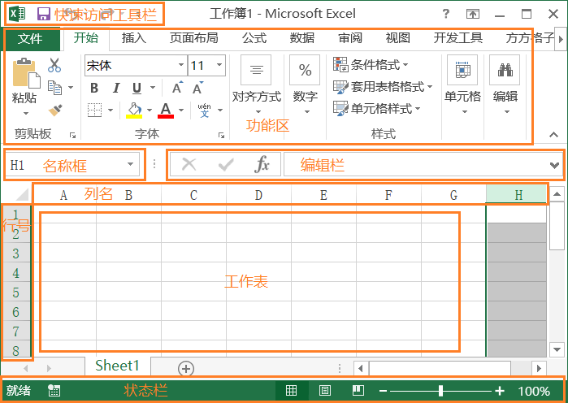
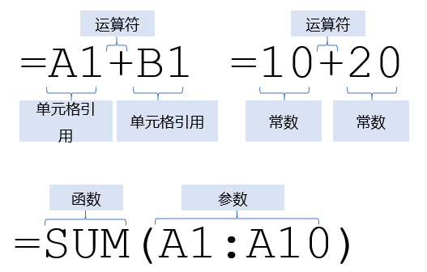
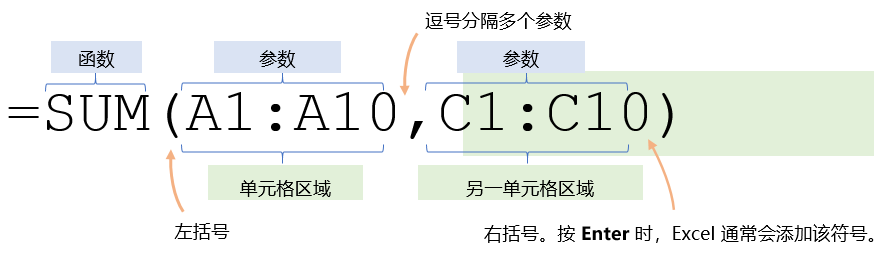
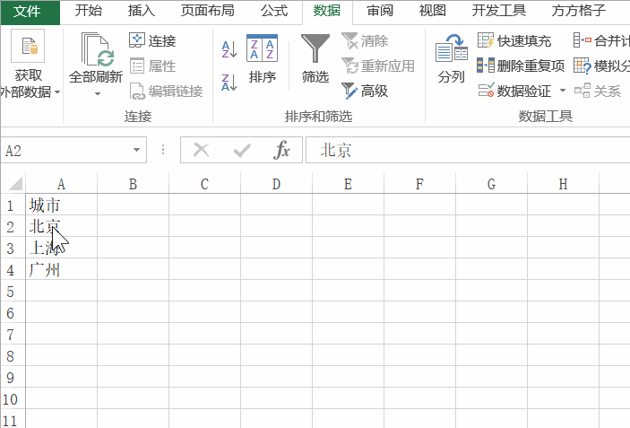
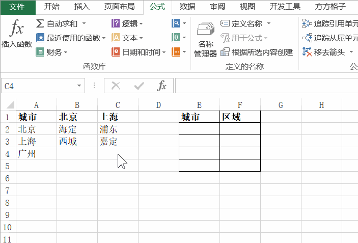
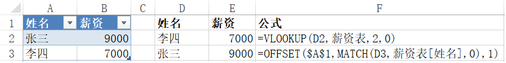
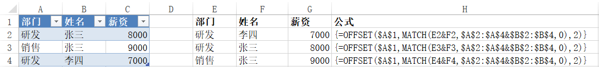

Excel相关
==============

[TOC]

## 基础

### 界面基本构成

* 快速访问工具栏
* 功能区
    * 功能区选项卡
    * 特殊工具的选项卡
        选中在特定的元素时出现，比如表格、绘图工具、图片工具等等
* 名称框 + 编辑栏
* 工作表 -> 行号 + 列名 + 单元格
* 状态栏

### 公式
1. Excel 中的公式始终以等号(=)开头
2. 公式组成部分
    * 函数
    * 引用
    * 常量/常数
    * 运算符

### 函数

1. Excel函数是一些预定义的功能, 可以对一个或多个值（称为参数）进行计算，并返回一个或多个值。
2. 函数组成部分
   * 函数名称
   * 参数
   * 返回值(函数处理的结果)

### 值类型

* 数字：`123`、`-1`、`0`

* 文本：`"abc"` `"你好"`
    * 文本中包含引号的方法：`"abc""123"` 表示 `abc"123`

* 单元格引用：`A1` `A1:B2`

* 逻辑值：`TRUE` `FALSE`

### 运算符

- 算数运算符
    `+ - * / % ^`
- 比较运算符
    `= > < >= <= <>`
- 文本运算符
    `&`

### 在公式中定义和使用名称

使用名称可使公式更加容易理解和维护。 可为单元格、单元格区域、函数、常量、表格等定义名称。

* 为单元格命名
  1. 选择单元格
  2. 在名称框中输入名称
  3. 按 <kbd>Enter</kbd>

* 定义所选区域的名称
  1. 选择要命名的区域，包括行或列标签。
  2. 选择“**公式**”>“**根据所选内容创建**”。
  3. 在“**以选定区域创建名称**”对话框中，通过选中“**首行**”、“**左列**”、“**末行**,或**右列**复选框来指定包含标签的位置。
  4. 选择“**确定**”。

* 在公式中使用名称
  1. 将公式中的数据用创建的**名称**代替即可
* 使用“名称管理器”管理工作簿中的名称
  1. 在“功能区”上, 转到**公式 > 已定义名称**>**名称管理器**。
  2. 然后可以创建、 编辑、 删除和查找工作簿中使用的所有名称。

### 单元格引用方式

* 相对 `A1` 行列会跟随变化
* 混合 `$A1` `A$1` 行或列会跟随变化
* 绝对引用 `$A$1` 行不列会跟随变化

### 区域引用

> 可组合使用，包括单元格引用

* 单个区域 `A1:B2`
* 联合区域 `(区域1,区域2...)`：多个区域合起来
* 交集区域 `(区域1 区域2...)`：多个区域相交的部分
* 整行区域 `1:1`:单行 `1:2`:多行
* 整列区域 `A:A`:单列 `A:B`:多列
* 跨Sheet `Sheet名称!区域`
* 跨文件 `'磁盘路径[文件名.xlsx]Sheet名称'!区域`
* 多个Sheet `Sheet1:Sheet3!区域)`：表示Sheet1到Sheet3中区域

## 函数分类

### 文本函数

* `len(text)` 返回文本字符串中的字符个数。
* `left(text, num_chars)` 返回文本字符串中左边的字符个数。
* `right(text, num_chars)` 返回文本字符串中右边的字符个数。
* `mid(text, start_num, num_chars)` 返回文本字符串中从指定位置开始的特定数目的字符
* `lower(text)` 将文本字符串中的字母转换为小写
* `upper(text)` 将文本字符串中的字母转换为大写
* `search(find_text, within_text, [start_num])` 查找一个字符串在另一个字符串中第一次出现的位置(不区分大小写，若要区分使用find)
* `replace(old_text，start_num，num_charts，new_charts)` 将一个字符串中的部分字符串用另外一个字符串替换
* `substitute(text，old_text，new_text，[instance_num])` 将一个字符串中的指定字符串用另外一个字符串替换
* `rept(text，number_times)` 根据指定次数重复文本
* `concatenate(text1, text2...)` 合并多个字符串为一个(类似&连接符)
* `trim(text)` 去除文本两边空格

### 查找索引函数
* `vlookup(lookup_value, table_array, col_index_num, [range_lookup])` 在某个区域中的首列查找特定的值并返回指定列的数据（先找行再找列）
* `hlookup(lookup_value, table_array, row_index_num, [range_lookup])` 在某个区域中查找首行特定的值并返回指定行的数据（先找列再找行）
* `column([reference])` 单元格在第几列
* `columns(array)` 指定区域有几列
* `row([reference])` 单元格在第几行
* `rows(array)` 指定区域有几行
* `index(array, row_num, [column_num])` 在指定的区域中获取指定行列的值
* `indirect(ref_text)` 通过引用获取指定单元格的值
* `match(lookup_value, lookup_array, [match_type])` [在某个区域(单列或单行)查找特定的值并返回所在索引位置](https://support.office.microsoft.com/zh-cn/article/match-%E5%87%BD%E6%95%B0-e8dffd45-c762-47d6-bf89-533f4a37673a)
* `offset(reference, rows, cols, [height], [width])` [指定单元格的行列偏移后的引用，可以指定要返回的行数和列数](https://support.office.microsoft.com/zh-cn/article/offset-%E5%87%BD%E6%95%B0-c8de19ae-dd79-4b9b-a14e-b4d906d11b66)

### 逻辑函数
* `and(logical1, [logical2], ...)` 全部为true结果为true
* `or(logical1, [logical2], ...)` 其中一个为true结果为true
* `not(logical)` 结果取反
* `if(logical_test, [value_if_true], [value_if_false])` 根据条件判断返回指定值
* `iferror(value, value_if_error)` 结果有错误时显示value_if_error，否则显示原来的值
* `ifna(value, value_if_na)` 结果为#N/A时显示value_if_error，否则显示原来的值

### 日期函数

### 数学函数
* `sum(number1, [number2], ...)` 求和
* `sumif(range,criteria,[sum_range])` 根据条件求和
* `sumproduct(array1，[array2]，…)` 多条件求和
* `randbetween(bottom, top)` 生成范围内随机整数
* `round(number, num_digits)` 四舍五入
* `mod(number, divisor)` 取余
* `int(number)` 向下取整

### 统计函数
* `average(number1，[number2],…)` 求平均数
* `averageif (range,criteria，[average_range])` 条件求平均数
* `count(value1,[value2],…)` 计算包含数值单元格个数
* `counta(value1,[value2],…)` 计算非空单元格个数
* `countblank(value1,[value2],…)` 计算空值单元格个数
* `countif(range,criteria)` 按条件统计单元格个数
* `min(number1, [number2],...)` 求最小值
* `max(number1, [number2],...)` 求最大值

### 其他函数

* `webservice(url)` 获取指定url的响应

## 技巧

### 快速移动行
1. 鼠标选中要移动的行
2. 按住<kbd>Shift</kbd>键，鼠标移动到单元格上边框或下边框
3. 按住鼠标左键向上或向下拖动至目标位置

### 快速移动列
1. 鼠标选中要移动的列
2. 按住<kbd>Shift</kbd>键，鼠标移动到单元格左边框或右边框
3. 按住鼠标左键向左或向右拖动至目标位置

### 快速填充(`Ctrl+E`)

1. 在首个单元格输入想要完成的“目标效果”
2. 选择首个单元格和全部要填充的同列连续单元格
3. 按<kbd>Ctrl</kbd> <kbd>E</kbd>，完成智能填充

可实现的功能

* 多个文本连接
* 文本分割
* 从文本提取中提取数据
* ……

### 快速跳转、选择

* 跳转：<kbd>Ctrl</kbd> <kbd>方向键</kbd>
* 选择：<kbd>Ctrl</kbd> <kbd>Shift</kbd> <kbd>方向键</kbd>

### 快速自动填充

1. 选中已有的数据单元格
2. 将光标置于单元格的右下角，直到它变为十字形
3. 鼠标双击完成填充

### 创建下拉列表

1. 将下拉选项列表转换为表格：选中下拉选项中任意单元格，按键<kbd>Ctrl</kbd> <kbd>T</kbd>，根据需求选择是否包含标题，确定
2. 在工作表中选择想要显示下拉列表的单元格。
3. 转到功能区上的“**数据**”选项卡，然后转到“**数据验证**”。
4. 在“**设置**”选项卡的“**允许**”框上，单击“**序列**”。
5. 单击“**来源**”框，然后选择列表区域。
6. 单击**确定**。

### 创建联动下拉列表

1. 将数据创建为名称，创建好之后在**名称框**中可以看到。
2. 和创建下拉列表一样创建好一级下拉列表。
3. 选择想要显示第二级下拉列表的单元格。
4. 转到功能区上的“**数据**”选项卡，然后转到“**数据验证**”。
5. 在“**设置**”选项卡的“**允许**”框上，单击“**序列**”。
6. 单击“**来源**”框，输入`indirect(对应的一级单元格引用)`。
7. 单击**确定**。
8. 多级以此类推。

### 单个条件查询

* `vlookup`实现
* 使用`match`和`offset`函数组合实现

> 已经将数据创建为表格，并重命名为新资表。

### 多条件查询

* 使用`match`和`offset`函数组合使用
* 注意：输入完公式后需要按<kbd>Ctrl</kbd> <kbd>Shift</kbd> <kbd>Enter</kbd>

### 单元格格式转换

* 格式为文本，内容为数字，但是左上角没有绿色的角标，如何出现绿色角标
    * 选中单元格->数据:分裂->下一步->下一步->文本->完成
* 格式为常规，内容为数字，但是左上角有绿色的角标，如何去除绿色角标
    * 方法一：选中单元格->点击周围的黄色图标->转换为数字
    * 方法二：选中单元格->数据:分裂->下一步->下一步->常规->完成

## 图表

## 数据透视表

## Excel官方练习题/手册

* [欢迎使用 Excel](https://templates.office.com/zh-CN/%e6%ac%a2%e8%bf%8e%e4%bd%bf%e7%94%a8-Excel-TM10000137)
* [公式教程](https://templates.office.com/zh-CN/%e5%85%ac%e5%bc%8f%e6%95%99%e7%a8%8b-TM16400656)
* [图表的 10 个提示](https://templates.office.com/zh-CN/%E5%9B%BE%E8%A1%A8%E7%9A%84-10-%E4%B8%AA%E6%8F%90%E7%A4%BA-TM22516108)
* [数据透视表教程](https://templates.office.com/zh-CN/%e6%95%b0%e6%8d%ae%e9%80%8f%e8%a7%86%e8%a1%a8%e6%95%99%e7%a8%8b-TM16400647)
* [更好地利用数据透视表](https://templates.office.com/zh-CN/%e6%9b%b4%e5%a5%bd%e5%9c%b0%e5%88%a9%e7%94%a8%e6%95%b0%e6%8d%ae%e9%80%8f%e8%a7%86%e8%a1%a8-TM16410255)
* [Excel官方手册](https://support.office.microsoft.com/zh-cn/excel)
