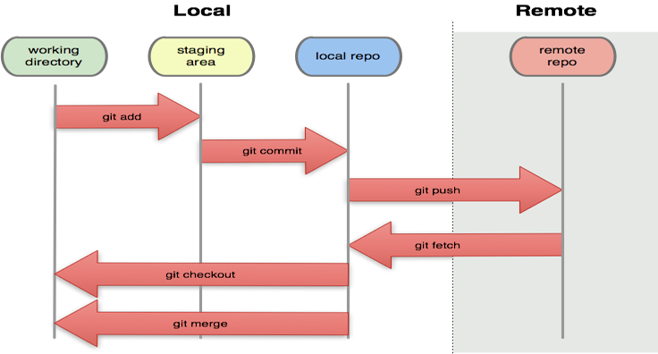

## 概述

> Git是一款免费、开源的分布式版本控制系统, 作者:Linux之父Torvalds 


## git的安装

> <http://msysgit.github.io/>  
> <https://git-scm.com>  
> 支持命令行和图像界面操作  


## 参数说明

* `<commit>`: 表示提交的版本号, 7个字母数字组合字符, 比如: c2139a8
* `<files>`: 表示一个或者多个文件的参数, 多个文件用空格隔开.
* `<????>`: 表示变化的参数, 必填的.
* `[????]`: 选填的参数.
* `.`: 点表示所有文件
* `HEAD`:上次提交 ( HEAD^ 上上次, 以此类推 )

> 注意: 参数中有空格的, 参数必须用双引号包裹起来.


## 创建仓库

```bash
# 创建本地仓库, 关联远程仓库
git init <项目名称> 
git remote add origin <仓库地址>

# 克隆远程仓库到本地, 空仓库不能克隆
git clone <仓库地址> [项目名称]
```


## 配置

```bash
# 仓库配置对应的配置文件路径[--local]
.git/config 

# 用户全局配置对应的配置文件路径[--global]
~/.gitconfig 

# 系统配置对应的配置文件路径[--local]
/etc/gitconfig 

git config --list
git config --global user.name <你的名字>
git config --global user.email <你的邮箱>
git config --global alias.co checkout
git config --global alias.ci commit
git config --global alias.st status
git config --global alias.br branch
git config --global core.autocrlf input
git config --global push.default matching
git config --global pull.default matching
git config --global alias.ll "log --oneline --all --decorate --graph"
```


## 工作区 => 暂存区 => 本地仓库 => 远程仓库 的操作
```bash

# 放弃 <= 工作区, 放弃工作区的修改(危险). 多个文件用空格隔开
git checkout -- <files>

# 工作区 => 暂存区, 添加文件到暂存区.
git add "文件" <files>

# 工作区 <= 暂存区, 放弃暂存区的添加, 重新回到未添加状态.
git reset HEAD <files>

# 暂存区 => 本地仓库, 提交到本地仓库.
git commit -m <message>

# 工作区 <= 本地仓库, 将HEAD重置到指定提交的版本，并将之间的修改标记为未添加到缓存区.
git reset <commit>

# 放弃 <= 本地仓库, 有提交记录
git revert <commit>

# 放弃 <= 本地仓库, 没有记录, 将HEAD重置到指定的版本，并抛弃该版本之后的所有修改(危险).
git reset --hart <commit>

# 本地仓库 => 远程仓库, 将本地当前分支推送到远程指定分支, 远程分支不存在会自动创建.
git push origin <分支名称/标签名称>
```


## 分支

```bash
# 查看所有本地分支, *号前面的为当前分支
git branch

# 查看所有远程分支
git branch -r

# 查看所有本地和远程分支
git branch -av

# 基于当前分支创建一个新的分支
git branch <分支名称>

# 切换分支
git checkout <分支名称>

# 基于当前分支创建并切换分支
git checkout -b <分支名称>

# 删除一个分支, 除了当前分支之外的分支
git branch -d <分支名称>

# 强制删除一个分支, 除了当前分支之外的分支
git branch -D <分支名称>

# 合并一个分支到当前分支, 保留记录(--no-ff), 可能会有冲突
git merge --no-ff <分支名称>

# 将分支上超前的提交，变基到当前分支,
git rebase <分支名称>

# 删除远程分支, 第2种 1.7之后可用
git push origin :<分支名称>
git push origin --delete <分支名称>
```


## 标签

```bash
# 查看所有本地标签
git tag

# 基于当前分支新建一个标签
git tag <标签名称>

# 删除一个标签
git tag -d <标签名称>

# 推送指定标签到远程
git push origin <标签名称>

# 推送本地全部标签到远程
git push origin --tags

# 删除指定的远程标签, 原理是将空的标签推送上去. 第二种1.7之后可用.
git push origin :refs/tags/<标签名称>
git push origin --delete <标签名称>
```


## 查看版本库状态&差异

```bash
# 查看状态
git status

# 工作区 <=> 暂存区
git diff

# 暂存区 <=> 本地仓库
git diff --cached
git diff --staged

# 工作区 <=> 本地仓库
git diff HEAD

# 工作区 <=> <分支名称>
git diff <分支名称>

# 工作区 <=> <commit>
git diff <commit>

# <commit> <=> <commit> , 本地和远程都可以
git diff <commit> <commit>

#查看提交历史
git log

# 友好的日志, 可以指定文件
git log --oneline --all --decorate --graph [dir/file]

#查看指定文件的历史
git log -p [文件/目录]

#查看指定文件的历史(列表形式)
git blame [文件]
```


## 远端

```bash
git fetch origin <分支名称> #拉去远端上指定分支
git merge origin/<分支名称> #合并远端上指定分支
git push origin <分支名称> #推送到远端上指定分支
git push origin localbranch:serverbranch #推送到远端上指定分支
git checkout -b test origin/dev #基于远端dev新建test分支
git push origin :分支名称 #删除远端分支, 原理是提交空的分支
```


## 源

```bash
git remote add origin <仓库地址>
git remote #显示全部源
git remote -v #显示全部源+详细信息
git remote rename origin origin2 #重命名
git remote rm origin #删除
git remote show origin #查看指定源的全部信息
```


## 其他

```bash
git help <command> #查看帮助的命令
```


从远程拉取分支到本地创建


    git checkout -b <分支名称> <源名称>/<远程分支名称>

## 良好的git协作方式

```bash
git checkout <功能分支>
#coding...
git add .
git commit -m 'message'
git checkout master
git pull
git checkout <功能分支>
git rebase master 如果有冲突在此时解决
git checkout master
git merge <功能分支>
git push origin master
```

## 图解git工作流程

