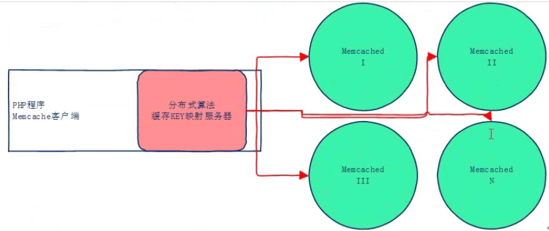

Memcache分布式缓存系统
====================

> [Memcache](http://memcached.org/)是免费开源、高性能、分布式、内存对象缓存系统

环境：
* CentOS7.3
* PHP7.4
* Memcache1.6.6


## 场景

* 因为受单机的内存容量限制，其缓存容量有限，而且会出现和应用服程序争内存的情况。
* 搭建一个分布式缓存系统（理论上可以做到不受内存限制的服务）、新增节点后扩容、部分节点宕机后可持续提供服务。

## 关键问题

* 如何搭建Memcache分布式缓存系统
* 分布式缓存服务新增节点、节点宕机后，缓存获取的命中率如何
* 如何选择合适的分配内存
* 如何监控


## 搭建Memcache分布式缓存系统

Memcache天生就支持分布式，应用起来非常简单，分布式算法由客户端提供，目前一般都采用Consistent Hashing算法，新增节点、节点宕机都有比较好的命中率。

分布式集群架构图:


### 安装服务
```bash
yum -y install gcc libevent libevent-devel
wget http://www.memcached.org/files/memcached-1.6.6.tar.gz
tar -zxf memcached-1.6.6.tar.gz
cd memcached-1.6.6
./configure --prefix=/usr/local/memcached
make && make install
```

### 启动服务
启动4个Memcached服务
```bash
/usr/local/memcached/bin/memcached -m 64 -p 11211 -u nobody -d
/usr/local/memcached/bin/memcached -m 64 -p 11212 -u nobody -d
/usr/local/memcached/bin/memcached -m 64 -p 11213 -u nobody -d
/usr/local/memcached/bin/memcached -m 64 -p 11214 -u nobody -d
```

### 安装PHP客户端
> 2.2.0开始支持Consistent Hashing，建议使用较新的版本。
```bash
rpm -Uvh https://dl.fedoraproject.org/pub/epel/epel-release-latest-7.noarch.rpm
rpm -Uvh http://rpms.remirepo.net/enterprise/remi-release-7.rpm
yum -y install php74-php php74-php-pecl-memcache
```

### 插入测试数据
插入100000条测试数据

init.php
```php
<?php
$memcache = new Memcache();
$memcache->addServer('127.0.0.1', 11211);
$memcache->addServer('127.0.0.1', 11212);
$memcache->addServer('127.0.0.1', 11213);
$memcache->addServer('127.0.0.1', 11214);
return $memcache;
```

set.php
```php
<?php
$memcache = require __DIR__ . '/init.php';
$num = 100000;
for ($i = 1; $i <= $num; $i++) {
    $memcache->set($i, uniqid(true));
}
```

```bash
$ php set.php
```

## 节点变更，测试命中率
```php
<?php
$memcache = require __DIR__ . '/init.php';
$num = 100000;
$hits = 0;
for ($i = 1; $i <= $num; $i++) {
    if ($memcache->get($i)) {
        $hits++;
    }
}
echo round($hits / $num * 100, 2);
```

```bash
$ php get.php
100
```

输出为：100，100%命中

新增一个Memcached节点
```bash
/usr/local/memcached/bin/memcached -m 64 -p 11215 -u nobody -d
```

init.php
```php
<?php
$memcache = new Memcache();
$memcache->addServer('127.0.0.1', 11211);
$memcache->addServer('127.0.0.1', 11212);
$memcache->addServer('127.0.0.1', 11213);
$memcache->addServer('127.0.0.1', 11214);
$memcache->addServer('127.0.0.1', 11215);
return $memcache;
```

```bash
$ php get.php
76.94
```

输出为：76.94

经过测试，有5台然后宕机1台命中率同样也为76.94%，有10台然后宕机1台命中率为88.64%，结果还是非常理想的。

随着缓存慢慢预热最终命中率会逐渐增高


## 如何选择合适的分配内存

启动时指定的内存是指保存数据的大小，不包括slab allocator（Memcache内存分配、管理机制）本身占用的内存、以及为了保存数据而设置的管理空间。

通过反复改变内存分配量进行验证，保证其不会因系统内存不足导致swap，这样的内存分配量就是合适的数值。


## 如何管理、监控

* `stats`命令
* [Memcache实时监控](https://github.com/DBezemer/memcachephp)
* [Memcache管理](https://github.com/junstor/memadmin)


## 参考
* [memcached完全剖析](https://kb.cnblogs.com/page/42731/)
