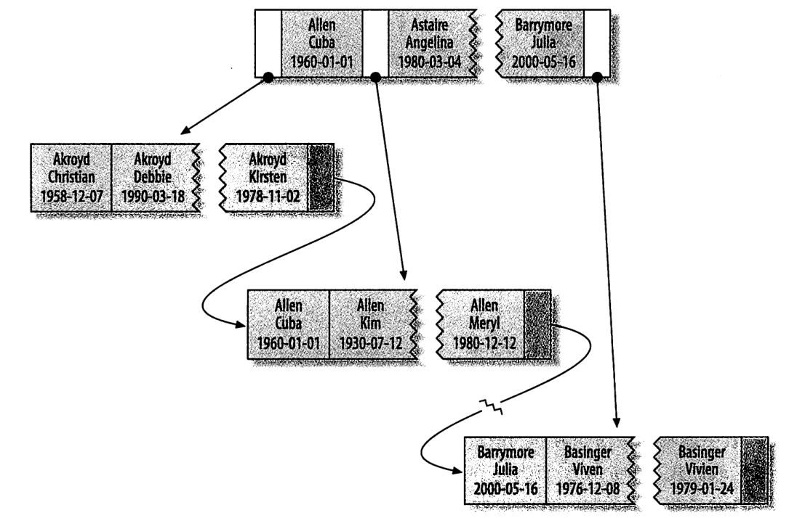
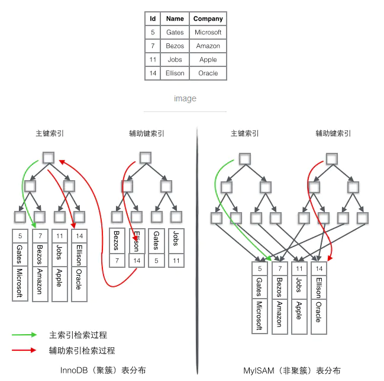

# 建立MySQL高性能索引

## 索引是什么？

> 索引（在MySQL中也叫做“键（key）”）是存储引擎快速找到记录的一种数据结构。

## 使用索引的优点

当表中的数据量越来越大，且未使用索引或使用不恰当时，查询性能则会急剧下降，此时创建一个高性能索引显得尤其重要，可以轻易将查询性能提高几个数量级。

总的来说有如下优点
1. 索引大大减少了服务器需要扫描的数据量
2. 索引可以帮助服务器避免排序和临时表
3. 索引可以将随机I/O变成顺序I/O

## 索引的缺点
1. 需要额外的空间来存储索引空间
2. 当插入或更新数据时数据库需要维护索引


## 索引分类/类型
* 主键索引
* 普通索引
* 唯一索引
* 全文索引


## 索引方法
* B+Tree
* Hash


## 建立高性能索引的策略

### 列独立
索引列不能是表达式的一部分，或者函数的参数（不在索引列上使用函数或运算符），否则会导致索引失效。  
错误示例：
```sql
SELECT * FROM user WHERE id+1=2;
SELECT * FROM user WHERE YEAR(created_at)=2020;
SELECT * FROM user WHERE FROM_UNIXTIME(created_time)='2020-09-01 00:00:00';
```
正确示例
```sql
SELECT * FROM user WHERE id=1;
SELECT * FROM user WHERE created_at TETWEEN '2020-01-01' AND '2020-12-31 23:59:59';
SELECT * FROM user WHERE created_time=UNIX_TIMESTAMP('2020-09-01 00:00:00');
```

### 前缀索引
有时候需要索引很长的字符列，这会让索引变得大且慢，这时可以选择字符串的前面一部分来建立索引，可以大大节约索引空间和提高索引效率。

选择前缀长度的依据：
* 原则：能保证有较高的选择性（查找时能过滤掉更多的行），同时又不能太长（以便于节约空间）
* 方法：
  * 1、找到前10条出现最频繁的数据列
  * 2、截取数据列的前N个字符再次做相同的统计
  * 3、直到频繁次数很相近，则该N值就是我们需要的前缀长度
* 举例：
    ```sql
    select count(*) total,username from user group by username order by total desc limit 10;
    select count(*) total,left(username,5) pref from user group by pref order by total desc limit 10;
    ```

### 多列索引
* 确定哪些列
    * 经常组合查询、排序或分组的列
* 选择合适的索引列顺序
  * 选择性高的优先，精准匹配优先
  * 选择性计算方法：`count(distinct col)/count(*)`，表示字段不重复的比例，比例越大扫描的记录数越少
* 索引结构

* 最左匹配原则
    * 从左往右匹配，中间空缺或出现范围匹配，则后面的列无法用到索引

### 聚簇索引

* 是一种数据存储结构，将数据存储与索引放到了一块，索引结构（B+树）的叶子节点保存了行数据
* 聚簇索引默认是主键，如果表中没有定义主键，InnoDB 会选择一个唯一的非空索引代替。如果没有这样的索引，InnoDB 会隐式定义一个主键来作为聚簇索引。
* 非聚簇索引：将数据与索引分开存储，索引结构的叶子节点指向了数据对应的位置（如MyISAM）。

聚簇索引和非聚簇索引的对比


### 覆盖索引
只访问索引的查询

### 列类型匹配
数据为字符串类型，查询时不加引号索引失效，反之可以

### 选择性不高的列不加索引
如性别


## 优化技巧

* AND查询条件顺序无关，无需担心顺序不对导致多列索引用不上，MySQL查询优化器会自动优化。
* 当多个单列索引、多列AND查询时只能用到一个索引，MySQL会自动选择性能最高的一列，这种情况查询较频繁时，推荐创建多列索引以全覆盖。
* 当多个单列索引，多列OR查询时，MySQL会自动合并索引，自动转换为UNION的方式。
* 可以根据需求创建多列索引结合前缀索引，如：
  ```sql
  ALTER TABLE ADD INDEX inx_1(col1,col2(10));
  ```
* 尽量扩展索引，不要新建索引，比如表中已经有a的索引，现在需要同时查询a和b列，那么可以删除原来的a索引，重新创建(a,b)多列索引。

## 参考
* <<高性能MySQL>>
* <https://www.cnblogs.com/dreamworlds/p/5398535.html>
* <https://www.jianshu.com/p/f5d4bbc74219>