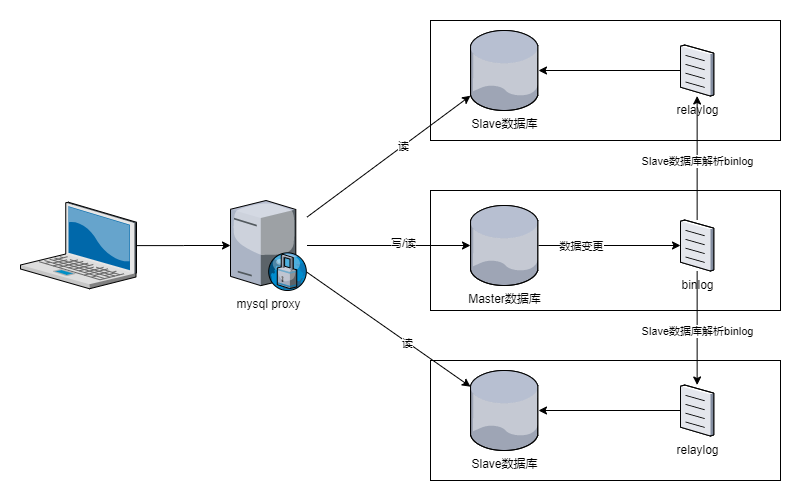

MySQL主从、读写分离实践
=========================
### 环境准备

这里准备3台Vmware虚拟机，均为2核2G，系统为Centos7.3，为方便测试已关闭防火墙和selinux。

| IP           |server-id| 用途           |
| ------------ |-------  | -------------- |
| 192.168.1.15 |1        | Master数据库    |
| 192.168.1.16 |2        | Slave数据库1    |
| 192.168.1.17 |3        | Slave数据库2    |

分别都安装好MySQL 5.7

架构图：




## 主从服务器配置

### Master服务器（192.168.1.15）：
* 配置节点编号、开启binlog

    `$ vim /etc/my.conf`
    ```ini
    server-id=1
    log-bin=mysql-bin
    binlog-format=mixed
    ```

    ```bash
    $ systemctl restart mysqld
    ```

* 创建、授权Slave账号
  
    创建一个用户名为slave、密码为slave的账号，Slave节点同步时需要的参数。
    ```sql
    GRANT REPLICATION CLIENT,REPLICATION SLAVE ON *.* TO 'slave'@'%' identified by 'slave';
    FLUSH PRIVILEGES;
    ```

    查看Master的状态，记录下File和Position，Slave节点同步时需要的参数。
    ```sql
    SHOW MASTER STATUS;
    ```
    ```
    mysql> SHOW MASTER STATUS;
    +------------------+----------+--------------+------------------+-------------------+
    | File             | Position | Binlog_Do_DB | Binlog_Ignore_DB | Executed_Gtid_Set |
    +------------------+----------+--------------+------------------+-------------------+
    | mysql-bin.000001 |      610 |              |                  |                   |
    +------------------+----------+--------------+------------------+-------------------+
    1 row in set (0.00 sec)
    ```

### Slave服务器（192.168.1.16、192.168.1.17）：
* 配置节点编号、配置relaylog
  
    `$ vim /etc/my.conf`
    ```ini
    server-id=2
    relay-log=mysql-relay
    read_only=1
    ```

    ```bash
    $ systemctl restart mysqld
    ```
* 使用授权的Slave账号连接到Master
    ```sql
    CHANGE MASTER TO 
    master_host='192.168.1.15',
    master_user='slave',
    master_password='slave',
    master_log_file='mysql-bin.000001',
    master_log_pos=610;
    ```

* 启动Slave
    ```sql
    START SLAVE;
    SHOW SLAVE STATUS\G
    ```
    ```
    mysql> START SLAVE;
    Query OK, 0 rows affected (0.01 sec)

    mysql> SHOW SLAVE STATUS\G
    *************************** 1. row ***************************
                Slave_IO_State: Waiting for master to send event
                    Master_Host: 192.168.1.15
                    Master_User: slave
                    Master_Port: 3306
                    ……
    ```


## 读写分离

### 框架层面

如框架支持读写分离机制，可使用框架提供的方式。

### [MySQL Proxy](https://downloads.mysql.com/archives/proxy/)

安装
```bash
wget https://downloads.mysql.com/archives/get/p/21/file/mysql-proxy-0.8.5-linux-el6-x86-64bit.tar.gz
tar zxf mysql-proxy-0.8.5-linux-el6-x86-64bit.tar.gz
mv mysql-proxy-0.8.5-linux-el6-x86-64bit /usr/local/mysql-proxy
cd /usr/local/mysql-proxy
mkdir conf log
touch log/mysql-proxy.conf
chmod 660 log/mysql-proxy.conf
```

配置
```bash
vim log/mysql-proxy.conf
```
```ini
[mysql-proxy]
proxy-address=0.0.0.0:4040
proxy-backend-addresses=192.168.1.15:3306 #read/write backend
proxy-read-only-backend-addresses=192.168.1.16:3306,192.168.1.17:3306 #read-only backend
proxy-lua-script=/usr/local/mysql-proxy/share/doc/mysql-proxy/rw-splitting.lua
pid-file=/usr/local/mysql-proxy/log/mysql-proxy.pid
log-file=/usr/local/mysql-proxy/log/mysql-proxy.log
plugins=proxy
log-level=debug #error|warning|info|message|debug
keepalive=true
daemon=true
```

启动
```bash
./bin/mysql-proxy --defaults-file=/usr/local/mysql-proxy/conf/mysql-proxy.conf
```

查询测试
```
ab -n10000 -c100 http://localhost/test.php

# 查询次数
192.168.1.15 => 0
192.168.1.16 => 6330
192.168.1.17 => 3670
```

需注意

执行修改类语句后，马上执行查询不一定会返回最新结果，原因是主从同步有延迟，并发越大效果越明显。

ab测试-n1000 -c100时的结果:  
查询到的为最新结果次数: 1984，不是最新结果次数：8016


### 其他解决方案

* [ProxySQL](https://proxysql.com/)
* [MaxScale](https://mariadb.com/kb/en/maxscale/)
* [MyCat](http://www.mycat.org.cn/)


## 参考

* <https://blog.csdn.net/vanvan_/article/details/97800883>