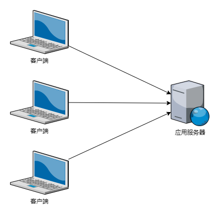
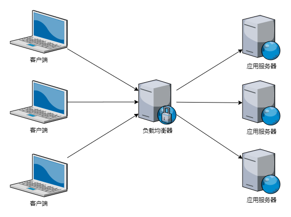
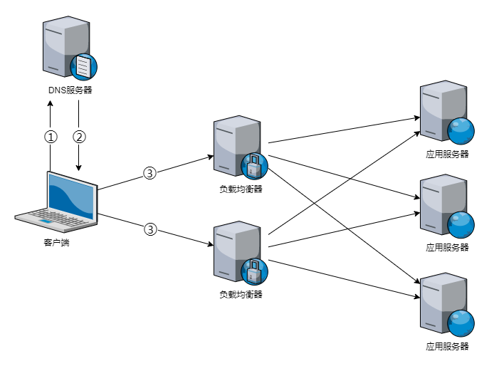

nginx搭建应用服务器集群
=====================


## 场景

随着网站业务增长，流量逐渐增大，一台服务器的处理能力不足时，就需要增加更多的服务器，将这些服务器搭建成集群以提供更强大的处理能力，如果有更多的用户，就在集群中加入更多的应用服务器，使应用服务器的负载压力不再成为整个网站的瓶颈

## 关键问题

* 使用nginx如何搭建集群
* 架构模式变更需要注意的地方


## 构架模型

### 单台应用服务器构架模型


应用服务器只有一台，而用户会一直增长

缺点：
1. 单点故障  
    服务器宕机后服务继续提供服务。
2. 服务器资源有限，无法水平扩展


### 集群应用服务器构架模型



一台负载均衡服务器，多台应用服务器

## 搭建应用服务器集群

### 环境准备

这里准备3台Vmware虚拟机，均为2核2G，系统为Centos7.3，为方便测试已关闭防火墙和selinux。

| IP           | 用途           |
| ------------ | -------------- |
| 192.168.1.15 | 负载均衡服务器 |
| 192.168.1.16 | 应用服务器1    |
| 192.168.1.17 | 应用服务器2    |

分别都安装好nginx


```bash
rpm -Uvh https://dl.fedoraproject.org/pub/epel/epel-release-latest-7.noarch.rpm
yum -y install nginx
```

**负载均衡服务器：**

编辑nginx配置问题，新增配置：

```bash
$ vim /etc/nginx/nginx.conf
```

```nginx
worker_processes auto;

events {
    worker_connections  1024;
}

http {

+    upstream web {
+         server 192.168.1.16;
+         server 192.168.1.17;
+    }
    
    server {
        location / {
+           proxy_pass http://web;
        }
    }
}
```
配置非常简单，在默认的配置基础上新增了5行代码，解释一下：

* `upstream web`：定义一个名字为web的反向代理集群
* `proxy_pass http://web;`：将请求转发到名字为web的集群

**应用服务器1：**

```bash
echo web01 > /usr/share/nginx/html/index.html
```

**应用服务器2：**

```bash
echo web02 > /usr/share/nginx/html/index.html
```


### 分发测试

默认按照轮询的方式来进行分发

```bash
$ curl http://192.168.1.15
web01
$ curl http://192.168.1.15
web02
$ curl http://192.168.1.15
web01
```


## nginx的分发算法
nginx的[upstream module](http://nginx.org/en/docs/http/ngx_http_upstream_module.html)支持多种分发方式，当应用服务器nginx服务不可用时，自动剔除，其他应用服务器继续提供服务。

常用的分发方式有：
* 轮询（默认）  
    每个请求按时间顺序依次分发，不考虑其他因素。

    多次请求输出：`web01 web02 web01 web02 web01 web02`
* weight  
    指定应用服务器的权重，默认为1，会和请求成正比，当应用服务器性能不一致的情况可以使用该方式。

    示例：
    ```nginx
    http {
        upstream web {
            server 192.168.1.16 weight=2;
            server 192.168.1.17;
        }
        server {
            location / {
                proxy_pass http://web;
            }
        }
    }
    ```

    多次请求输出：`web01 web01 web02 web01 web01 web02`
* least_conn  
    会选择连接最少的应用服务器进行分发，同时会考虑设置的weight值，比轮询和weight更智能。

    示例：
    ```nginx
    http {
        upstream web {
            least_conn;
            server 192.168.1.16 weight=2;
            server 192.168.1.17;
        }
        server {
            location / {
                proxy_pass http://web;
            }
        }
    }
    ```

    多次请求输出：`web01 web01 web02 web01 web01 web02`
* ip_hash  
    顾名思义，按照客户端IP的hash结果来分发，同一个IP会被分发到同一个应用服务器。

    示例：
    ```nginx
    http {
        upstream web {
            ip_hash;
            server 192.168.1.16;
            server 192.168.1.17;
        }
        server {
            location / {
                proxy_pass http://web;
            }
        }
    }
    ```

    多次请求输出：`web01 web01 web01 web01 web01 web01`

* hash  
    可以根据自定义参数进行hash的结果来分发，比如url，同时会考虑设置的weight值。

    示例：
    ```nginx
    http {
        upstream web {
            hash $request_uri consistent;
            server 192.168.1.16;
            server 192.168.1.17;
        }
        server {
            location / {
                proxy_pass http://web;
            }
        }
    }
    ```

    请求输出：`curl http://192.168.1.15?v=hello`：web02  
    请求输出：`curl http://192.168.1.15?v=grass`：web01  

如果是有状态应用，可以选择`ip_hash`，当然有状态应用不是好的架构，不推荐。  
若无其他特殊要求推荐使用`least_conn`，应用服务器性能不一致时配合`weight`使用。

## nginx的分发参数

* backup  
    * 标记为备用，当其他应用服务器忙时，其才参与分发
    * 不能和`ip_hash`分发算法同时使用，配置校验会失败。
    * 示例：`server 192.168.1.16 backup;`
* weight  
    * 指定权重，不指定默认为1。
    * 示例：`server 192.168.1.16 weight=2;`
* max_fails  
    * 指定最大连接失败的次数，达到次数时表示服务不可用，默认为1次。
    * 示例：`server 192.168.1.16 max_fails=3`
* fail_timeout  
    * 指定连接超时时间，默认10秒。
    * 示例：`server 192.168.1.16 max_fails=3 fail_timeout=30s`
* down  
    * 标记为下线，不参与分发。
    * 示例：`server 192.168.1.16 down;`


## 架构模式变更需要注意的地方

* 应用应保持无状态，每个应用服务器本身并不保存任何用户数据，比如session、应用文件等，新增或移除应用服务器时不影响业务。
* session：选择分布式缓存系统来保存用户状态。
* 应用文件：应用产生的文件保存到统一的文件服务器或分布式文件系统中。


## 其他

### 客户端访问IP转发

使用nginx转发后，在应用服务器上无法获取到客户端的真实IP，所以在负载均衡服务器需要转发客户端IP

配置：
```nginx
http {
    upstream web {
        server 192.168.1.16;
        server 192.168.1.17;
    }
    server {
        location / {
            proxy_pass http://web;
+           proxy_set_header Host $host;
+           proxy_set_header X-Real-IP $remote_addr;
+           proxy_set_header X-Forwarded-For $proxy_add_x_forwarded_for;
        }
    }
}
```

## 多台负载均衡服务器

当一台负载均衡服务器压力过大，处理不过来时，就需要多台负载均衡服务器。

域名解析时添加多个A记录，分别指向多个载均衡服务器外网IP，每次域名请求时DNS会根据负载均衡算法返回不同的IP地址。

此时的架构模型如下：



流程：
1. 客户访问网站域名
2. 经过DNS服务器解析，返回其中一台负载均衡服务器的IP
3. 客户端访问IP对应的负载均衡服务器
4. 负载均衡服务器根据分发算法请求其中一台应用服务器
5. 应用服务器响应给负载均衡服务器
6. 负载均衡服务器响应给客户端


## 参考

* <http://nginx.org/en/docs/>
* <https://www.cnblogs.com/xiugeng/p/10155283.html>