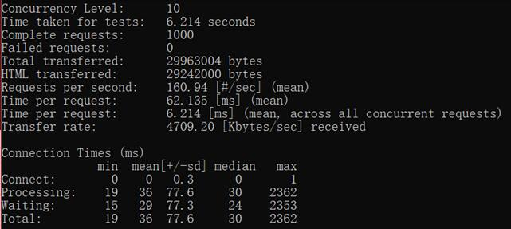

OPCache
==============

> OPcache 通过将 PHP 脚本预编译的字节码存储到共享内存中来提升 PHP 的性能， 存储预编译字节码的好处就是 省去了每次加载和解析 PHP 脚本的开销。

## CentOS

安装
```bash
yum -y install php56w-opcache
# or
yum -y install php70w-opcache
```

在php.ini配置文件中加入:
```ini
zend_extension=opcache.so
opcache.enable=1
opcache.enable_cli=1
```

## Windows

> PHP版本要求>=5.5

在php.ini配置文件中加入:
```ini
zend_extension=opcache.dll
opcache.enable=1
opcache.enable_cli=1
```

## 测试结果

测试对象为Yii2 默认首页，参数 `ab -n1000 -c10`

PHP5.6 未启用OPcache


PHP5.6 启用OPcache


PHP7.0 未启用OPcache


PHP7.0 启用OPcache




## 更多

* <https://www.php.net/opcache>
